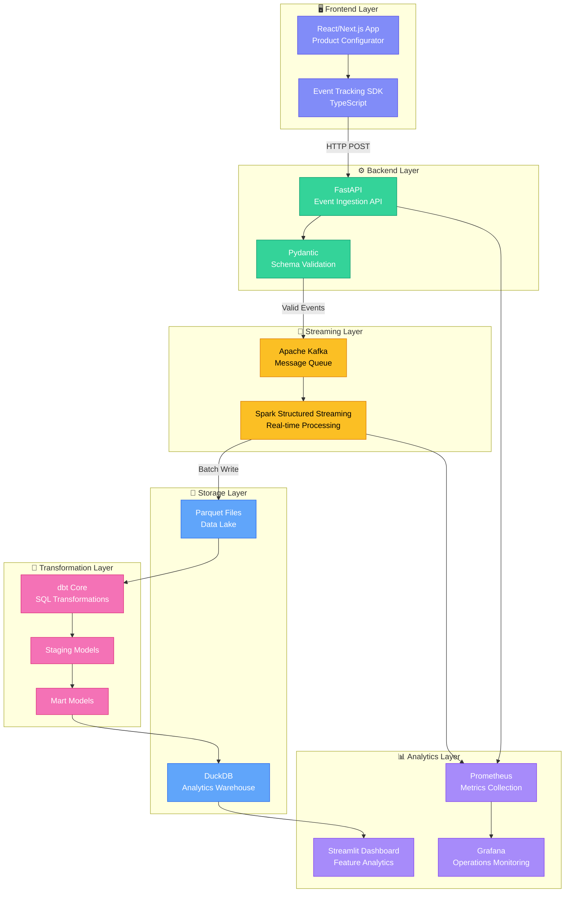
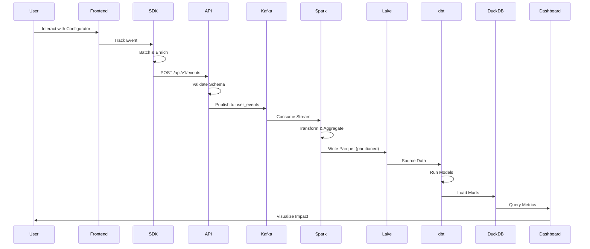

# Feature Launchpad Architecture

## System Overview

Feature Launchpad is an end-to-end data engineering platform for measuring product feature impact. It demonstrates a production-grade event-driven architecture that captures, processes, transforms, and visualizes user engagement data.

## Architecture Diagram



## Data Flow



## Component Details

### 1. Frontend Layer

**Product Configurator (React/Next.js)**
- 4-step quiz flow: Team Size → Use Case → Features → Budget
- Polished UI with Tailwind CSS and animations
- Recommendation engine matching users to data tools

**Event Tracking SDK (TypeScript)**
- Automatic session management
- Event batching (10 events or 5s interval)
- Retry logic with exponential backoff
- Offline queue support
- Type-safe event schemas

### 2. Backend Layer

**Event Ingestion API (FastAPI)**
- REST endpoints: `/api/v1/events`, `/api/v1/events/batch`
- Pydantic schema validation with 15+ event types
- Kafka producer with idempotent delivery
- Prometheus metrics integration
- Health check endpoints

### 3. Streaming Layer

**Apache Kafka**
- Topic: `user_events` (partitioned by user_id)
- Retention: 7 days
- Exactly-once semantics enabled

**Spark Structured Streaming**
- Kafka consumer with checkpointing
- Watermarking for late data (10 min threshold)
- Micro-batch processing (30s trigger)
- Real-time aggregations (sessions, funnels)

### 4. Storage Layer

**Data Lake (Parquet)**
- Partitioned by: `event_date/event_hour`
- Columnar compression for efficient queries
- Schema evolution support

**Analytics Warehouse (DuckDB)**
- Embedded OLAP database
- Direct Parquet file queries
- Sub-second analytical queries

### 5. Transformation Layer

**dbt Core Models**

```
models/
├── staging/
│   └── stg_events.sql          # Clean & flatten raw events
├── marts/
│   ├── core/
│   │   ├── fact_events.sql     # Enriched event fact table
│   │   └── dim_users.sql       # User dimension with segments
│   └── engagement/
│       ├── engagement_metrics.sql  # Daily KPIs
│       └── funnel_analysis.sql     # Conversion funnel
```

### 6. Analytics Layer

**Streamlit Dashboard**
- Real-time KPI cards
- Conversion funnel visualization
- "Money Slide": Retention lift comparison
- Device breakdown analysis
- Time series trends

**Grafana (Operations)**
- Pipeline latency monitoring
- Kafka lag tracking
- Error rate alerts

## Key Metrics Computed

| Metric | Description | Location |
|--------|-------------|----------|
| Adoption Rate | % of DAU using configurator | `engagement_metrics.sql` |
| Completion Rate | Quiz start → completion | `engagement_metrics.sql` |
| Engagement Depth | Avg events per session | `engagement_metrics.sql` |
| Retention Lift | Return rate: completers vs non | `engagement_metrics.sql` |
| Funnel Drop-off | Per-step conversion rates | `funnel_analysis.sql` |
| Share Rate | % completing who share result | `engagement_metrics.sql` |

## Exactly-Once Guarantees

1. **Kafka Producer**: Idempotent delivery enabled (`enable.idempotence=true`)
2. **Spark Consumer**: Checkpointing to durable storage
3. **dbt**: Incremental models with unique keys
4. **Event Deduplication**: UUID-based event_id dedup in staging

## Scalability Considerations

| Component | Horizontal Scaling | Vertical Scaling |
|-----------|-------------------|------------------|
| API | Load balancer + replicas | More workers |
| Kafka | Add partitions + brokers | More RAM |
| Spark | Add workers | More cores/memory |
| DuckDB | Read replicas | More RAM (single-node) |

## Local Development

```bash
# Start all services
docker-compose up -d

# Generate sample data
python pipeline/scripts/simulate_events.py --users 100 --days 7

# Run dbt transformations
docker-compose exec dbt dbt run

# Access dashboard
open http://localhost:8501
```

## Production Deployment Notes

For production deployment, consider:

1. **Replace Kafka** with managed service (Confluent Cloud, AWS MSK)
2. **Replace DuckDB** with cloud warehouse (Snowflake, BigQuery, Databricks)
3. **Add Airflow** for dbt orchestration
4. **Enable TLS** on all service communications
5. **Add authentication** to dashboard and API
6. **Configure alerting** in Grafana
